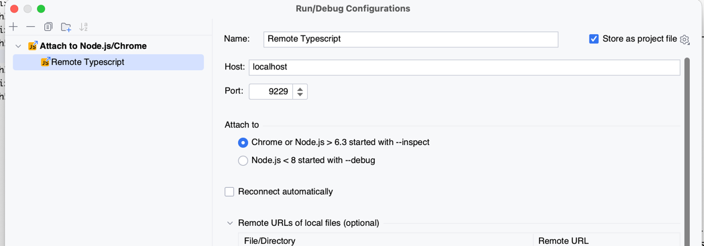

<h3><b> 1.Install all dependencies:</b></h3> 
<i>npm install </i>
<h3><b> 2.Run for setup(in Typescript/src folder):</b></h3> 
<i>openapi-generator --overwrite  --input resources/service-specs --outputDir apisdk</i> 
<h3><b> 3.Run for deploy(in TypeScript folder):</b> </h3>
<i>npm run deploy</i> 
<h3><b> *For Debugging: </b></h3>
<i>cf ssh rndbackend -N -T -L 9229:127.0.0.1:9229   </i>  
<h5>After run the command in terminal:</h5>
**Debug breakpoints should be at builded *.js files.

<h3><b> *For connect to postgresql :</b></h3>
<i>cf ssh rndbackend  -L 3951:&lt;DBHostname&gt;:&lt;DBPort&gt; </i>
<h5>After run the command in terminal:</h5>

